# Minidoracat Vehicle Spawn Control for B42

讓伺服器管理員用遊戲內面板或設定檔，調整各區域生成多少車、生成哪些車；原版與 MOD 車輛都會自動列出。單人遊戲也能使用。

Project Zomboid Build 42 MOD。

## 截圖

### 繁體中文

| | |
|---|---|
| 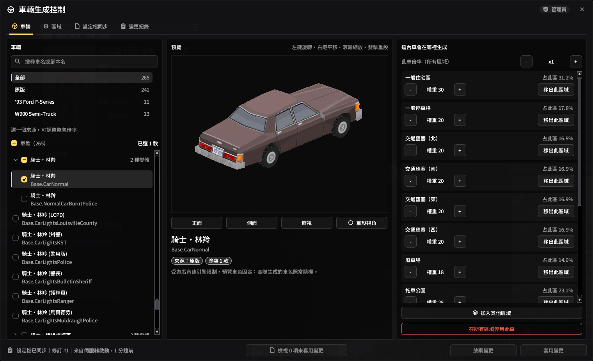 | 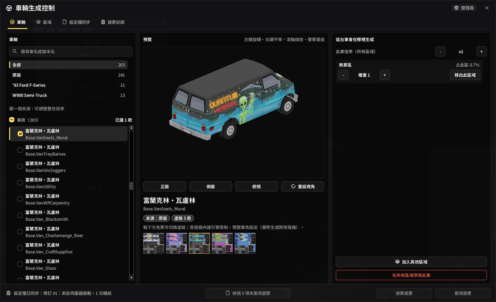 |
| 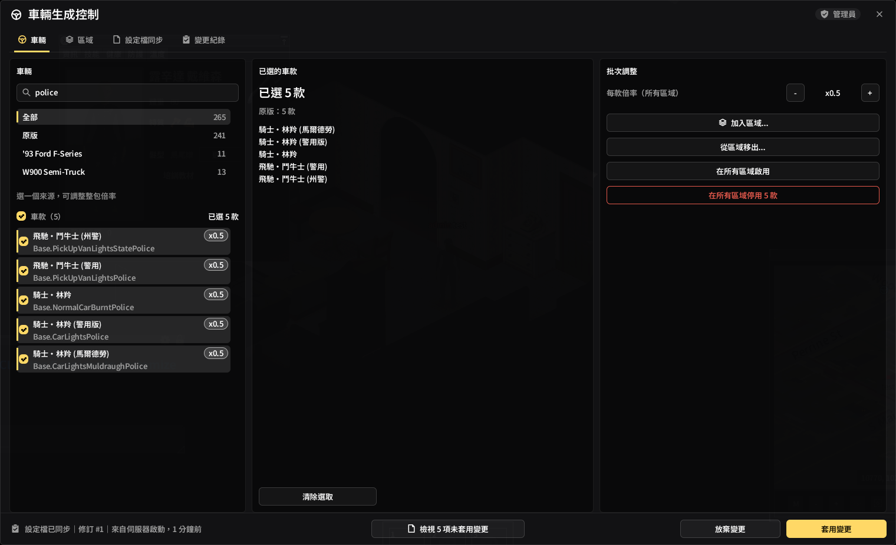 |  |
| 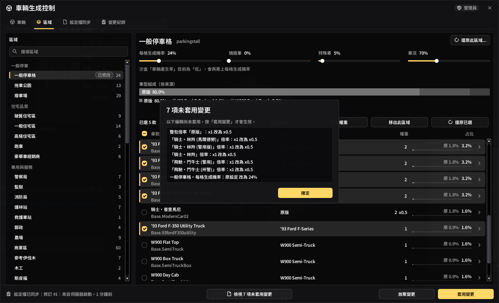 | 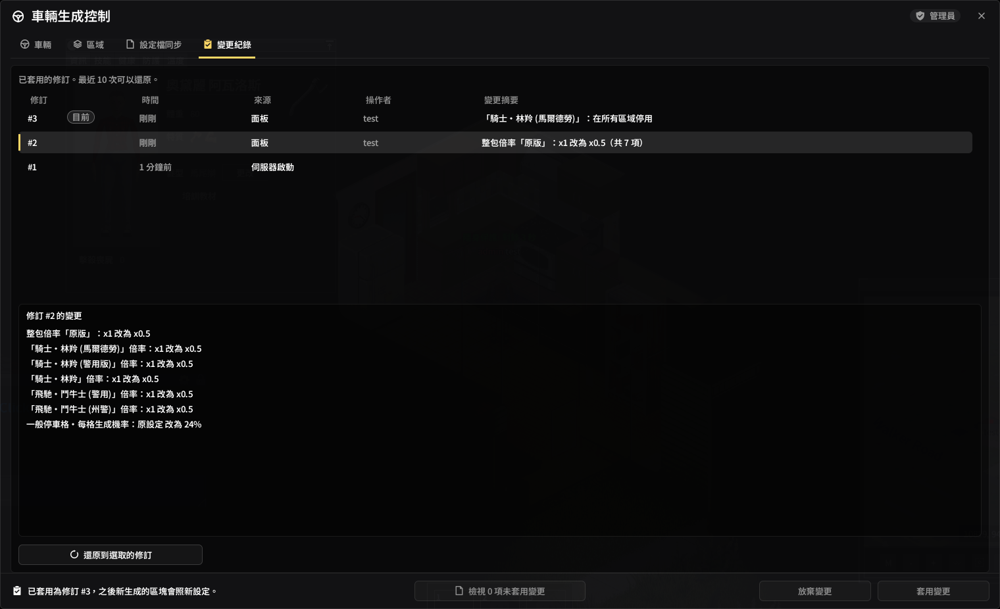 |

### English

| | |
|---|---|
| 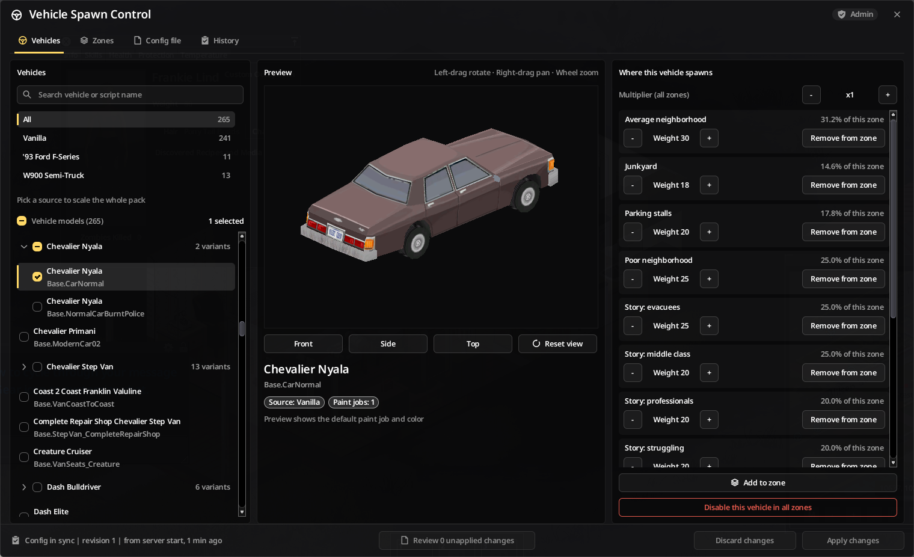 | 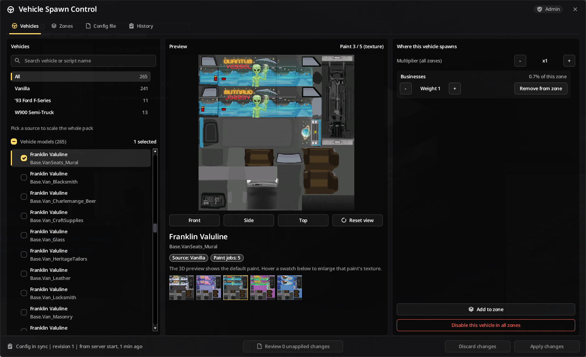 |
| 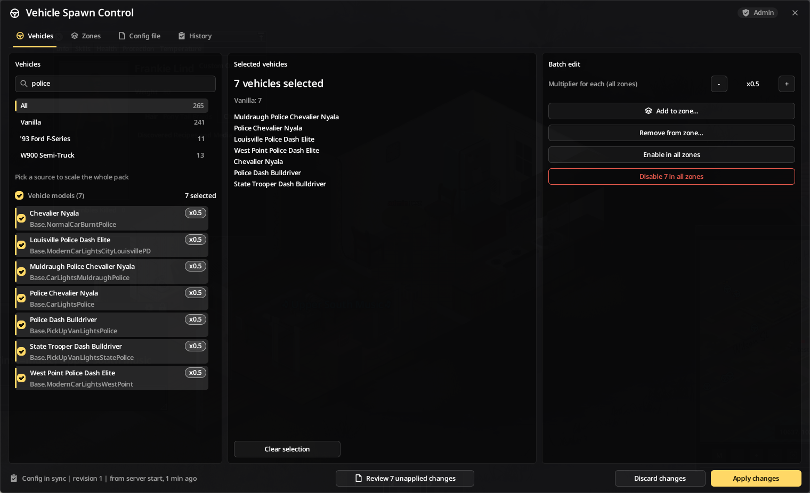 | 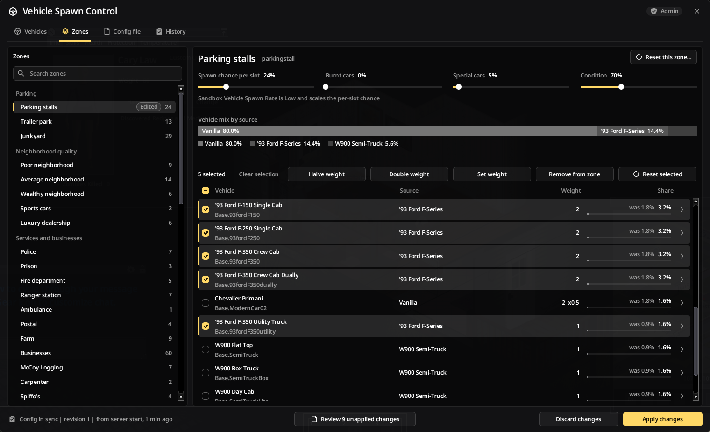 |
| 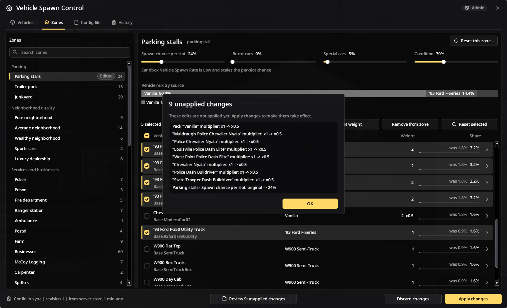 | 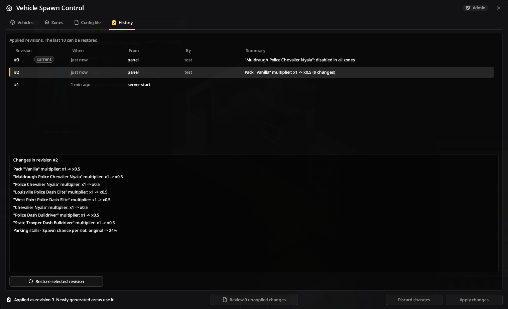 |

日文截圖在 `docs/screenshots/jp/`。Steam Workshop 用的 JPG（每張 ≤280KB）在 `docs/screenshots/steam/{en,zh,jp}/`，`publish_workshop.py --mode screenshots` 依英文→中文→日文、檔名順序同步到作品頁。

## 功能

- **自動收錄車輛**：開服時列出原版與所有已安裝 MOD 的車輛，依實際載入紀錄分出來源 MOD，同名變體收成一組
- **調整生成數量**：各區域的每格生成機率，以及一般車、燒毀車、特殊車、零件損壞、附鑰匙的機率與車況
- **調整車型比例**：整個 MOD 一起調的整包倍率、單一車款的倍率、各區域的車款權重；可以停用車款、把車加進原本沒有它的區域、指定生成的塗裝
- **遊戲內面板**：多人從原版管理面板最後一格進入；單人在地上按右鍵選「車輛生成控制」。分成車輛、區域、設定檔同步、變更紀錄四個分頁；3D 預覽可旋轉、平移、縮放，多塗裝車款會列出各款塗裝色票
- **設定檔**：也可以直接編輯 `config.json`，存檔後約一分鐘內自動生效，不必重啟伺服器
- **防誤操作**：面板的修改先列成未套用變更，按下套用才生效；設定檔有錯時保留原本的設定，並寫出第幾行、哪個欄位、該怎麼改；最近 10 份生效過的設定自動備份，可從變更紀錄還原
- **權限**：沿用原版角色的「沙盒設定」權限（預設為版主與管理員），伺服器端也會再次檢查；單人不需要權限

調整只影響之後第一次生成的區塊，已經生成的車不會重抽。

## 設定檔

位置：PZ 使用者目錄下的 `Lua/MinidoracatVehicleSpawnControl/`。專用伺服器是伺服器的使用者目錄（預設 `~/Zomboid`，Windows 為 `%USERPROFILE%\Zomboid`，可用 `-cachedir` 改）；單人是玩家自己的使用者目錄。

| 檔案 | 用途 |
|---|---|
| `config.json` | 管理員編輯的設定，只記和原本不同的地方 |
| `catalog.json` | 唯讀：所有車款、來源 MOD、出現在哪些區域與實際占比，用來查正確的車款名與區域名 |
| `status.json` | 唯讀：最近一次檢查是否成功、錯誤、警告與新偵測的車 |
| `history.json`、`backups/` | 變更紀錄（最近 50 筆）與最近 10 份生效設定的備份 |
| `state.json` | 內部狀態（修訂號、各車款第一次出現的時間），不要手改 |

```json
{
  "schema": 1,
  "newVehicles": "keep",
  "sources": {
    "pz-vanilla": { "multiplier": 1.0 },
    "SomeVehiclePack": { "multiplier": 0.5 }
  },
  "vehicles": {
    "Base.CarLightsPolice": { "enabled": false },
    "Base.PickUpTruck": { "multiplier": 2.0 }
  },
  "zones": {
    "parkingstall": {
      "spawnRate": 16,
      "chanceToSpawnBurnt": 0,
      "weights": { "Base.CarNormal": 20, "Base.VanAmbulance": 3 },
      "skins": { "Base.CarNormal": 2 }
    }
  }
}
```

實際權重＝區域權重 × 車款倍率 × 來源倍率；結果是 0 或被停用的車會從該區移除。權重是同一區內的相對比例，總車量由 `spawnRate` 決定。區域名要和 `catalog.json` 列的完全相同（大小寫也算）。各欄位的完整說明見 [STEAM_DISCUSSION_guide.md](STEAM_DISCUSSION_guide.md)。

## 安裝

- Steam Workshop：尚未上架（上架後補上連結）
- **必要前置 MOD**：[Minidoracat UI Library](https://steamcommunity.com/sharedfiles/filedetails/?id=3789836701)（`require=MinidoracatUIFor42`；沒有訂閱時本 MOD 不會載入）
- 專用伺服器：`Mods=` 加入 `MinidoracatUIFor42` 與 `MinidoracatVehicleSpawnControlFor42`，`WorkshopItems=` 加入兩者的 Workshop ID
- 手動安裝：把 `MOD/MinidoracatVehicleSpawnControlFor42/Contents/mods/MinidoracatVehicleSpawnControlFor42` 複製到 `%USERPROFILE%\Zomboid\mods\`

## 開發

- `link_workshop.bat`：手動同步、狀態檢查與歸檔卸載（實體副本，不建立連結）
- `PZ_Test.bat`：啟動前自動同步 MOD 與家族依賴；Steam／no-Steam／Debug／多開皆保留
- 提交前閘門：`uv run scripts/verify_mod.py`（靜態檢查）與 `lua scripts/smoke_harness.lua`（行為測試）
- 若 PZ 不在預設安裝路徑，用環境變數 `PZ_PATH` 指向遊戲目錄
- 設計提案與視覺稿：`docs/design-proposals/`

## 版本

版本號格式：`{PZ 版本}-{mod 版本}`（例 `42.21.0-0.1.0`），詳見 [CHANGELOG.md](CHANGELOG.md)。

## 授權

本專案採 [MIT License](LICENSE)（Copyright (c) 2026 Minidoracat），涵蓋作者持有權利的全部內容：`MOD/**/media/lua/` 下的 Lua 與翻譯 JSON、`mod.info`／`workshop.txt`、`scripts/` 下的 Python／PowerShell／Lua 工具與測試、專案文件，以及依自訂提示詞產製的封面與設計視覺稿（`preview.png`、`42/poster.png`、`workshop/preview.gif`、`docs/design-proposals/images/`）。

下列內容含第三方權利，不在 MIT 授權範圍內：

- `docs/screenshots/**`：Project Zomboid 實際遊戲畫面截圖，畫面內容權利屬 The Indie Stone，僅作為本 MOD 的說明用途。
- Project Zomboid 引擎、API、遊戲素材與商標屬 The Indie Stone；Steamworks API 屬 Valve，兩者都不隨本專案散布。

程式碼註解與文件中的 `*.java:行號` 是對 Project Zomboid 引擎行為的出處標註，本倉庫不含任何反編譯原始碼。

## 作者

Minidoracat — [Discord](https://discord.gg/Gur2V67) | [Twitch](https://www.twitch.tv/minidoracat)

### 發布到 Workshop

首發用遊戲內 Workshop 上傳器（只有它能建立新作品）。之後的更新雙擊 `Publish_Workshop.bat`：先確認 Steam 用戶端已以作者帳號登入，
再選擇更新 MOD 內容（含 `STEAM_CHANGELOG.md` 更新說明）／GIF 封面／簡介／預覽圖／全部；提交後回查 Steam，
任一不符即以非零碼結束。設定在 `scripts/workshop_publish.json`（Workshop ID、簡介語言槽來源、GIF 路徑）。

```
uv run --no-project python -B scripts/publish_workshop.py --mode all --yes       # 自動化／AI；或 content / preview / description / screenshots
uv run --no-project python -B scripts/publish_workshop.py --mode all --dry-run   # 只檢查、顯示計畫
```

退出碼：`0` 成功／`2` 參數或取消／`3` 未登入、帳號不是擁有者／`4` 前置檢查失敗／`5` 提交失敗／`6` 已提交但回查不符。
網頁動態封面放 `MOD/<資料夾>/workshop/preview.gif`（不在 `Contents/`，不會下載給玩家）；遊戲內上傳器仍用 `preview.png`，
且每次會把網頁封面覆回靜態，需要動態封面時一律改用本工具發布。
